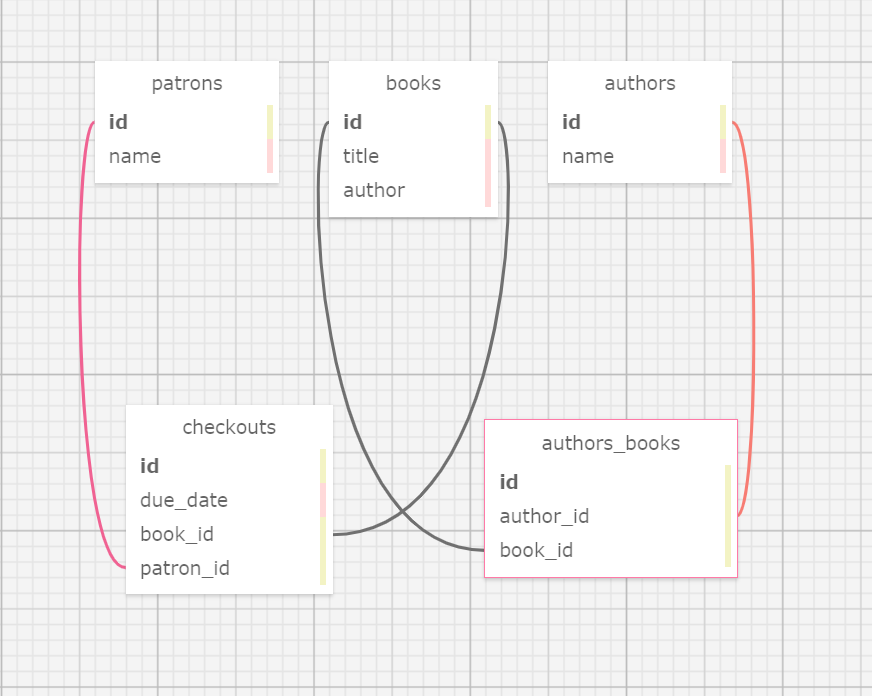

# *Library*
* * *
{Brief description of application}, 10/7/2020

By **Joseph Karnafel, AJ Markow**

## Description

{Description}

## Setup/Installation Requirements

{Setup Requirements}

## Database Schema

</img>

## User Stories

| Spec     | Behavior | 
| -------- | -------- | 
| 1 | As a librarian, I want to create, read, update, delete, and list books in the catalog, so that we can keep track of our inventory. | 
| 2 | As a librarian, I want to search for a book by author or title, so that I can find a book easily when the book inventory at the library grows large. |
| 3 | As a patron, I want to check a book out, so that I can take it home with me. |
| 4 | As a patron, I want to see a history of all the books I checked out, so that I can look up the name of that awesome sci-fi novel I read three years ago. |
| 5 | As a patron, I want to know when a book I checked out is due, so that I know when to return it. |
| 6 | As a librarian, I want to see a list of overdue books, so that I can call up the patron who checked them out and tell them to bring them back - OR ELSE! |
| 7 | As a librarian, I want to enter multiple authors for a book, so that I can include accurate information in my catalog. |

## Known Bugs

{Known Bugs}

## Support and contact details

{Contact Details}

## Technologies Used

{Technologies Used}

### License

MIT License

Copyright (c) 2020 Joseph Karnafel, AJ Markow

Permission is hereby granted, free of charge, to any person obtaining a copy
of this software and associated documentation files the Software, to deal
in the Software without restriction, including without limitation the rights
to use, copy, modify, merge, publish, distribute, sublicense, and/or sell
copies of the Software, and to permit persons to whom the Software is
furnished to do so, subject to the following conditions:

The above copyright notice and this permission notice shall be included in all
copies or substantial portions of the Software.

THE SOFTWARE IS PROVIDED AS IS, WITHOUT WARRANTY OF ANY KIND, EXPRESS OR
IMPLIED, INCLUDING BUT NOT LIMITED TO THE WARRANTIES OF MERCHANTABILITY,
FITNESS FOR A PARTICULAR PURPOSE AND NONINFRINGEMENT. IN NO EVENT SHALL THE
AUTHORS OR COPYRIGHT HOLDERS BE LIABLE FOR ANY CLAIM, DAMAGES OR OTHER
LIABILITY, WHETHER IN AN ACTION OF CONTRACT, TORT OR OTHERWISE, ARISING FROM,
OUT OF OR IN CONNECTION WITH THE SOFTWARE OR THE USE OR OTHER DEALINGS IN THE
SOFTWARE.

Copyright (c) 2020 ***Joseph Karnafel, AJ Markow***
